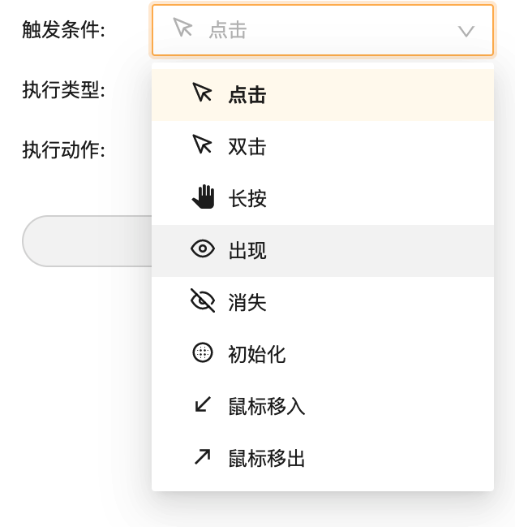
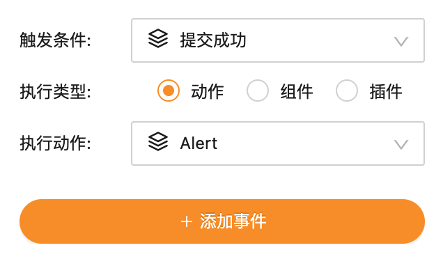
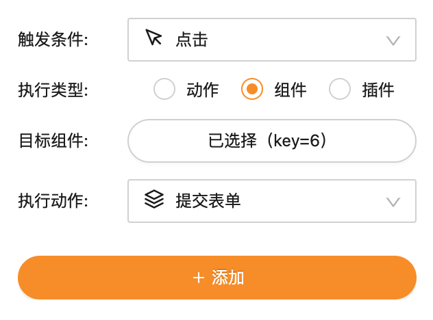

---
meta:
  - name: description
    content: 开发：组件自定义事件触发
  - name: keywords
    content: 开发 组件自定义事件触发 dev
---

# 组件中的事件

## 1. 默认事件触发

Vize 默认提供丰富的事件触发器：



- **点击**: 对应 `onClick`，点击时触发
- **双击**：通过 `onClick` 实现，在 `200ms` 内连续点击两次触发
- **长按**：通过 `onTouchStart & onTouchEnd`（移动设备） 与 `onMouseDown & onMouseUp`（PC） 实现，长按超过 `1000ms` 触发
- **初始化**：通过 React 的 `useEffect` Hook 实现，组件渲染完毕后触发
- **出现**：通过 `IntersectionObserver` API 实现，组件出现在浏览器视口后触发
- **消失**：通过 `IntersectionObserver` API 实现，组件消失在浏览器视口后触发
- **鼠标移入**：通过 `onMouseEnter` 实现，鼠标移入时触发
- **鼠标移出**：通过 `onMouseLeave` 实现，鼠标移出时触发

::: tip 🌟 提示
默认事件触发也适用于组件内的热区
:::

## 2. 自定义事件触发

默认的事件触发是组件维度的，有时我们需要更加细粒度的事件触发，如通过组件内部一段自定义的逻辑触发事件。

这时可以通过自定义事件触发 API 实现：

### 声明事件

编辑组件 `config.ts`，增加 `emitEvents` 字段：

```ts {4}
export default {
  info: { ... },
  emitEvents: [
    { displayName: "<事件在编辑器中的展示名>", eventName: "<唯一的事件名>" },
  ],
};
```

### 触发事件

编辑组件 `index.ts`，接收 `emit` Props，通过 `emit(<eventName>)` 来实现事件触发调用：

```tsx {4}
import * as React from 'react';

export default function({ emit }) {
  emit('<eventName>');

  return <h1>Hello</h1>;
}
```

:::warning ⚠️ 注意
组件内 `emit` 的参数 `eventName` 必须与 `config.ts` 中声明的一致。
:::

### 示例

实现一个表单组件，当表单提交成功后触发 “提交成功” 事件。

编辑 `config.ts`：

```ts {4}
export default {
  info: { ... },
  emitEvents: [
    { displayName: '提交成功', eventName: 'submitSuccess' },
  ],
};
```

编辑 `index.ts`：

```tsx {19}
import * as React from 'react';

export default class Example extends React.Component {
  public state = {
    name: '',
  };

  private fakeAsyncSubmit = () => {
    return new Promise(resolve => {
      setTimeout(() => {
        console.log('submitSuccess', this.state.name);
        resolve();
      }, 2000);
    });
  };

  private onSubmit = async () => {
    await this.fakeAsyncSubmit();
    this.props.emit('submitSuccess');
  };

  private onNameChange = ({ target: { value: name } }: React.KeyboardEvent<HTMLDivElement>) => {
    this.setState({ name });
  };

  public render() {
    return (
      <div>
        <input type="text" placeholder="请输入姓名" value={this.state.name} onChange={this.onNameChange} />
        <button onClick={this.onSubmit}>提交</button>
      </div>
    );
  }
}
```

<br></br>
然后就能在编辑器中的 **"事件"** Tab，为该组件的 “提交成功” 事件绑定动作：



## 3. 自定义事件回调

Vize 物料可以将内部的逻辑通过自定义事件 API 暴露给系统，来实现由外部触发组件内部的逻辑。

### 声明事件

编辑组件 `config.ts`，增加 `onEvents` 字段：

```js {4}
export default {
  info: { ... },
  onEvents: [
    { displayName: "<事件在编辑器中的展示名>", eventName: "<唯一的事件名>" },
  ],
};
```

### 注册 & 取消事件回调

编辑组件 `index.tsx`，接收 `on` Props，通过 `on(<displayName>, <callback>)` 来注册事件回调；接收 `cancel` Props，通过 `cancel(<displayName>, <callback>)` 来取消注册事件回调：

```tsx {7,9}
import * as React from 'react';

export default function({ on, cancel }) {
  // 也可以在其他时机注册或取消回调
  // 在事件被触发时，如果没有回调被注册，则会跳过该事件的回调执行
  React.useEffect(() => {
    on("<displayName>", <callback>);
    // cancel 是可选的，vize 会在组件生命周期结束前自动销毁所有回调
    return () => cancel("displayName", <callback>);
  }, []);

  return <h1>Hello</h1>;
}
```

:::warning ⚠️ 注意
组件内 `on` 和 `cancel` 的参数 `displayName` 必须与 `config.ts` 中声明的一致。
:::

### 示例

实现一个表单组件，可以由外部触发 “提交表单” 动作。

编辑 `config.ts`：

```js {8}
export default {
  info: { ... },
  onEvents: [
    { displayName: '提交成功', eventName: 'submitSuccess' },
  ],
};
```

编辑 `index.tsx`：

```tsx {9}
import * as React from 'react';

export default class Example extends React.Component {
  public state = {
    name: '',
  };

  public componentDidMount() {
    this.props.on('submit', this.onSubmit);
  }

  private fakeAsyncSubmit = () => {
    return new Promise(resolve => {
      setTimeout(() => {
        console.log('submitSuccess', this.state.name);
        resolve();
      }, 2000);
    });
  };

  private onSubmit = async () => {
    await this.fakeAsyncSubmit();
    window.alert('Submit success');
  };

  private onNameChange = ({ target: { value: name } }: React.KeyboardEvent<HTMLDivElement>) => {
    this.setState({ name });
  };

  private render() {
    return (
      <div>
        <input type="text" placeholder="请输入姓名" value={this.state.name} onChange={this.onNameChange} />
        <button onClick={this.onSubmit}>提交</button>
      </div>
    );
  }
}
```

<br></br>
然后就能在编辑器中的 **"事件"** Tab，**"执行类型"** 选择 **"组件"**，**目标组件**选择该组件，即可选择触发该组件的 “提交表单” 动作：


