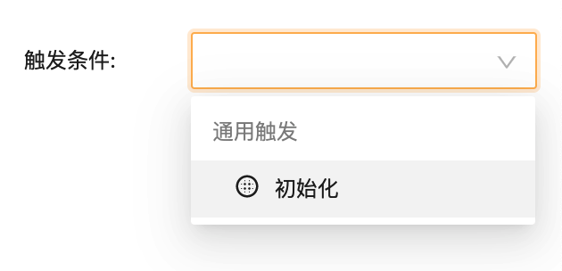
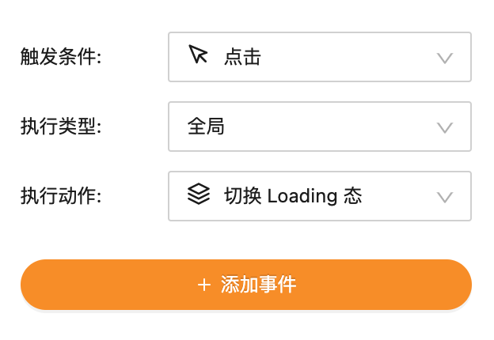

---
meta:
  - name: description
    content: 开发：组件自定义事件触发
  - name: keywords
    content: 开发 组件自定义事件触发 dev
---

# 全局事件

## 1. 默认事件触发

与组件类似，Vize 为全局事件提供默认的事件触发器：



- **初始化**: 页面初始化后触发

## 2. 自定义事件触发

与组件类似，Vize 支持通过页面容器内部一段自定义的逻辑触发事件。这需要借助自定义事件触发 API 实现：

### 声明事件

与组件类似，编辑页面容器 `config.ts`，增加 `emitGlobalEvents` 字段：

```ts {4}
export default {
  info: { ... },
  globalEmitEvents: [
    { displayName: "<事件在编辑器中的展示名>", eventName: "<唯一的事件名>" },
  ],
};
```

### 触发事件

与组件类似，编辑页面容器 `index.ts`，接收 `emit` 参数，通过 `emit(<eventName>)` 来实现事件触发调用：

```tsx {7}
export default function({ render, emit }) {
  // 渲染页面
  render();

  // 也可以在其他时机触发事件
  // 如 doSomething().then(() => emit('<eventName>'))
  emit('<eventName>');
}
```

### 示例

实现一个倒计时功能，当计时结束时，触发 “倒计时结束” 事件。

编辑 `config.ts`：

```ts {10,11,12}
export default {
  info: { ... },
  globalDataForm: {
    countdownTime: {
        title: '倒计时时间',
        type: 'number',
        required: true,
    }
  },
  globalEmitEvents: [
    { displayName: '倒计时结束', eventName: 'countdownEnd' },
  ],
};
```

编辑 `index.ts`：

```tsx {3}
export default function({ render, emit, data: { countdownTime } }) {
  render();
  setTimeout(() => emit('countdownEnd'), countdownTime * 1000);
}
```

<br></br>
然后就能在编辑器中全局的 **"事件"** Tab，为页面的 “倒计时结束” 事件绑定动作：


## 3. 自定义事件回调

与组件类似，页面容器也可以将内部的逻辑通过全局自定义事件 API 暴露给系统，来实现由其他物料触发页面容器内部的逻辑。

### 声明事件

编辑页面容器 `config.ts`，增加 `globalOnEvents` 字段：

```ts {3}
export default {
  info: { ... },
  globalOnEvents: [{ displayName: "<事件在编辑器中的展示名>", eventName: "<唯一的事件名>" }],
};
```

### 注册 & 取消事件回调

与组件类似，编辑页面容器 `index.ts`：

- 接收 `on` 属性，通过 `on(<eventName>, callback)` 来注册事件回调
- 接收 `cancel` 属性，通过 `cancel(<eventName>, callback)` 来取消注册事件回调

```ts {2,6}
export default function({ render, on }) {
  render();

  on('<eventName>', callback);

  if (needCancel) {
    // cancel 是可选的，vize 会在页面容器生命周期结束前自动销毁所有回调
    cancel('<eventName>', callback);
  }
}
```

### 示例

在页面容器中实现一个统一的 loading 态，可以由其他物料触发 "切换 Loading 态" 动作。

编辑 `config.ts`：

```ts {3}
export default {
  info: { ... },
  globalOnEvents: [{ displayName: '切换 Loading 态', eventName: 'toggleLoading' }],
};
```

编辑页面容器 `index.html.ejs`：

```ejs {12}
<body>
    ...
    <style type="text/css">
        #loading {
            width: 100vw;
            height: 100vh;
            position: fixed;
            background: white;
            display: block;
        }
    </style>
    <div id="loading">loading</div>
</body>
```

编辑页面容器 `index.ts`：

```ts {2}
export default function({ render, on }) {
  on('toggleLoading', toggleLoading);
  render();
  // 渲染完成后隐藏 loading
  toggleLoading(false);
}

const loading = document.querySelector('#loading');

function toggleLoading(visible?: boolean) {
  const shouldShow = typeof visible === 'boolean' ? visible : loading.style.display === 'none';
  loading.style.display = shouldShow ? 'block' : 'none';
}
```

<br></br>
然后就能在编辑器中的 **"事件"** Tab，**"执行类型"** 选择 **"全局"**，**目标动作**选择该事件，即可选择触发全局的 “切换 Loading 态” 动作：


