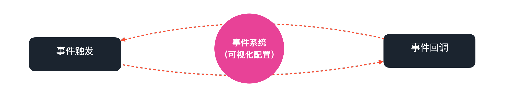

---
meta:
  - name: description
    content: 页面容器
  - name: keywords
    content: 开发 快速上手
---

# 了解事件系统

## 1. 概念

传统的搭建体系，物料间相互独立、不可交互。这也导致物料通常都粒度较大、灵活度很低。

而 Vize 通过一套中心化的事件系统，实现物料间的通信与交互。

物料开发者只需要通过 Vize 提供的一系列标准化的**事件通信 API** 简单的监听或者触发事件即可。

## 2. 抽象方式

所有的事件逻辑，抽象出来都是由两个要素组成：

- **事件触发**
- **事件回调**

由触发条件触发回调，执行回调逻辑。同时，回调逻辑也可以作为触发条件，继续触发下一个事件的回调，这样就可以将所有逻辑串联起来。

在 Vize 中，系统提供一系列默认的通用事件触发，如：点击组件、执行插件等。除此之外，所有的物料都可以注册自定义的事件触发和事件回调。
