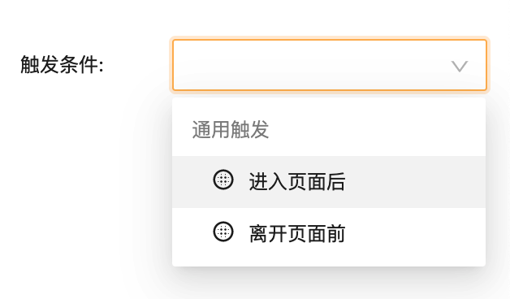

---
meta:
  - name: description
    content: 开发：组件自定义事件触发
  - name: keywords
    content: 开发 组件自定义事件触发 dev
---

# 页面中的事件

对于存在多个子页面的情况（通常是单页模式下），页面级别的事件很有用，可以用来实现切换拦截等功能。

## 1. 默认事件触发

与组件类似，Vize 为页面提供默认的事件触发器：

- **进入页面后**: 进入页面后触发
- **离开页面前**: 离开当前页面时触发。可用于拦截页面切换。
