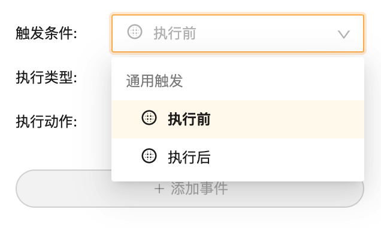
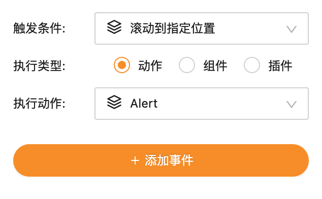
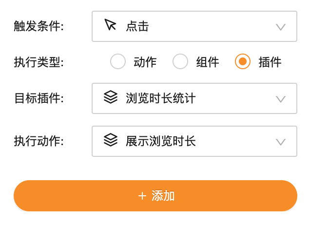

---
meta:
  - name: description
    content: 开发：组件自定义事件触发
  - name: keywords
    content: 开发 组件自定义事件触发 dev
---

# 插件中的事件

## 1. 默认事件触发

与组件类似，Vize 为插件提供默认的事件触发器：



- **执行前**: 插件函数执行前执行
- **执行后**：插件函数执行后执行，如果插件函数为异步，则会等待异步完后成执行

## 2. 自定义事件触发

与组件类似，Vize 支持通过插件内部一段自定义的逻辑触发事件。这需要借助自定义事件触发 API 实现：

### 声明事件

与组件类似，编辑插件 `config.ts`，增加 `emitEvents` 字段：

```ts {4}
export default {
  info: { ... },
  emitEvents: [
    { displayName: "<事件在编辑器中的展示名>", eventName: "<唯一的事件名>" },
  ],
};
```

### 触发事件

与组件类似，编辑插件 `index.ts`，接收 `emit` 参数，通过 `emit(<eventName>)` 来实现事件触发调用：

```tsx {4}
export default function({ emit }) {
  // 也可以在其他时机触发事件
  // 如 doSomething().then(() => emit('<eventName>'))
  emit('<eventName>');

  doPluginThings();
}
```

### 示例

实现一个滚动监听插件，当滚动页面到指定高度时，触发 “滚动到指定位置” 事件。

编辑 `config.ts`：

```ts {4}
export default {
  info: { ... },
  dataForm: {
    scrollHeight: {
        title: '滚动位置高度',
        type: 'number',
        required: true,
    }
  },
  emitEvents: [
    { displayName: '滚动到指定位置', eventName: 'scrollToPosition' },
  ],
};
```

编辑 `index.ts`：

```tsx {4}
export default function({ emit, data: { scrollHeight } }) {
  document.body.addEventListener('scroll', () => {
    if (document.body.scrollTop >= scrollHeight) {
      emit('scrollToPosition');
    }
  });
}
```

<br></br>
然后就能在编辑器中的 **"事件"** Tab，为该插件的 “滚动到指定位置” 事件绑定动作：



## 3. 自定义事件回调

与组件类似，插件也可以将内部的逻辑通过自定义事件 API 暴露给系统，来实现由外部触发插件内部的逻辑。

### 声明事件

与组件类似，编辑插件 `config.ts`，增加 `onEvents` 字段：

```js {4}
export default {
  info: { ... },
  onEvents: [
    { displayName: "<事件在编辑器中的展示名>", eventName: "<唯一的事件名>" },
  ],
};
```

### 注册 & 取消事件回调

与组件类似，编辑插件 `index.ts`，接收 `on` 属性，通过 `on(<displayName>, <callback>)` 来注册事件回调；接收 `cancel` Props，通过 `cancel(<displayName>, <callback>)` 来取消注册事件回调：

```ts {2,6}
export default function({ on, cancel }) {
    on("<displayName>", <callback>);

    if (needCancel) {
      // cancel 是可选的，vize 会在插件生命周期结束前自动销毁所有回调
      cancel("displayName", <callback>)
    }
}
```

### 示例

实现一个页面浏览时长统计上报的插件，可以由外部触发 “展示浏览时长” 动作。

编辑 `config.ts`：

```js {8}
export default {
  info: { ... },
  onEvents: [
    { displayName: '展示浏览时长', eventName: 'showViewDuration' },
  ],
};
```

编辑 `index.tsx`：

```tsx {22}
export default function({ on }) {
  let duration = 0;
  let timer = null;

  const endTimer = () => {
    if (timer) {
      clearInterval(timer);
    }
    timer = null;
  };

  const startTimer = () => {
    timer = setInterval(() => (duration += 5), 5000);
  };

  window.addEventListener('pagehide', endTimer);
  window.addEventListener('pageshow', endTimer);
  window.addEventListener('beforeunload', () => reportDuration(duration));

  startTimer();

  on('showViewDuration', () => alert(`你已经浏览了 ${duration} 秒`));
}
```

<br></br>
然后就能在编辑器中的 **"事件"** Tab，**"执行类型"** 选择 **"插件"**，**目标插件**选择该插件，即可选择触发该插件的 “展示浏览时长” 动作：


